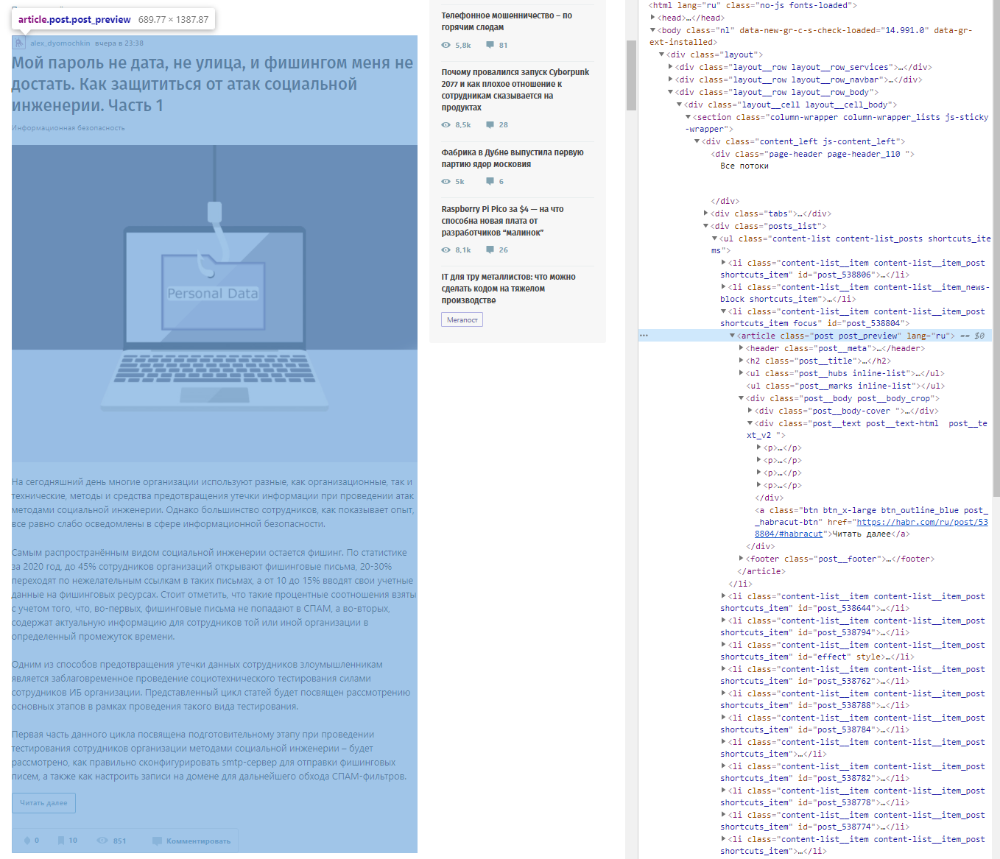

### Новостное приложение - парсер для habr.com

Новостное приложение, которое парсит страницу со свежими статьями на [Хабре](https://habr.com) и выбирает те статьи, в которых встречается хотя бы одно из ключевых слов. Ключевые слова определяются в коде. Программа анализирует не только preview-информацию статьи (т.е. информацию, доступную с текущей страницы), но и весь текст статьи целиком.
В консоль выводится список подходящих статей в формате: `<дата> – <заголовок> – <ссылка>`.

Пример preview:

